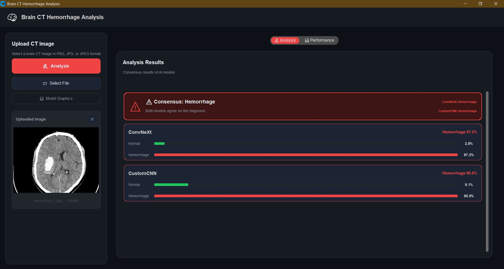
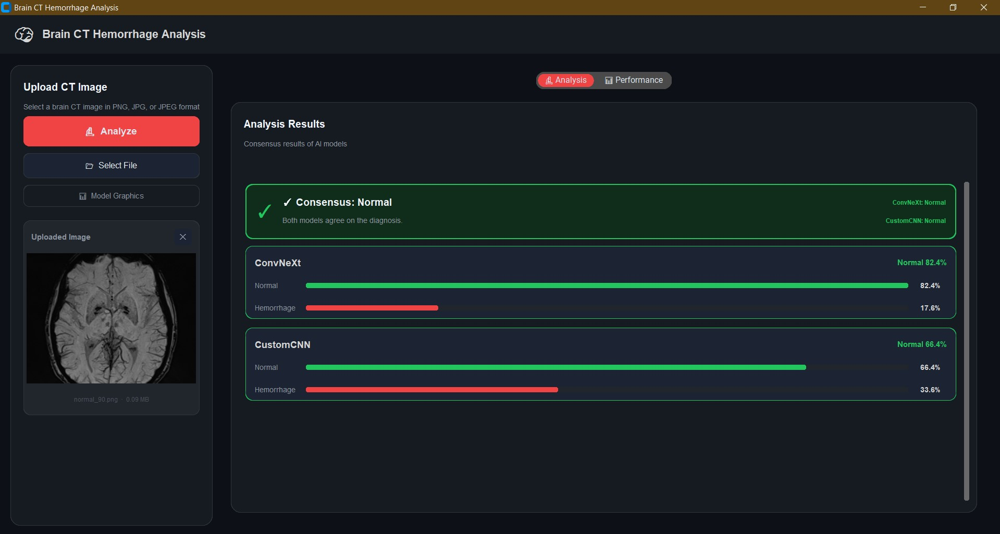
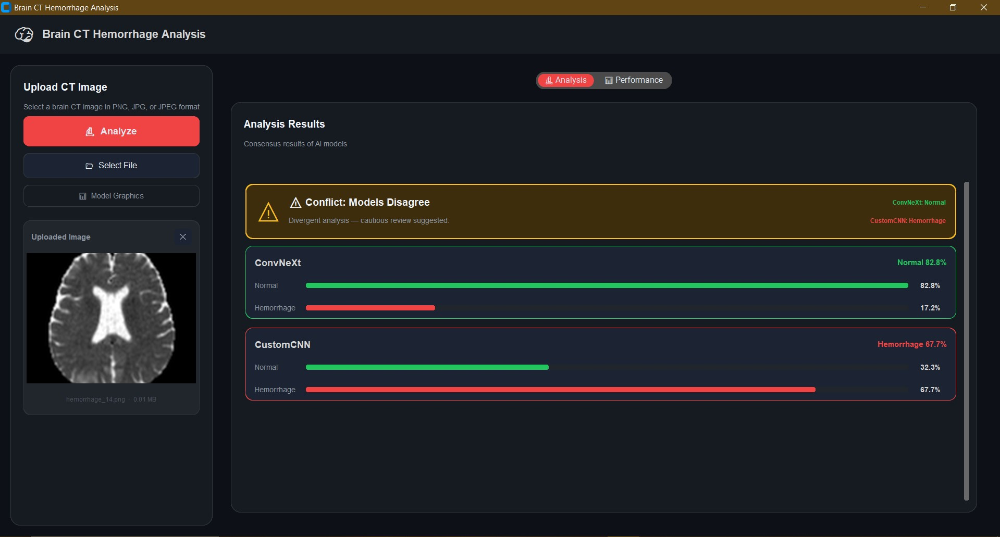
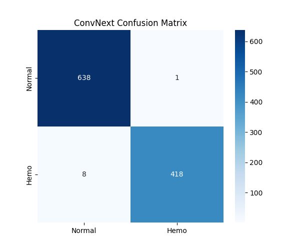
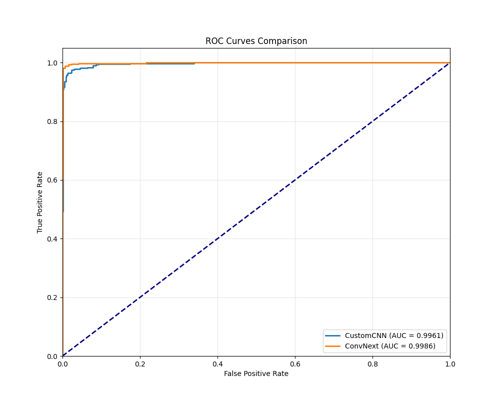
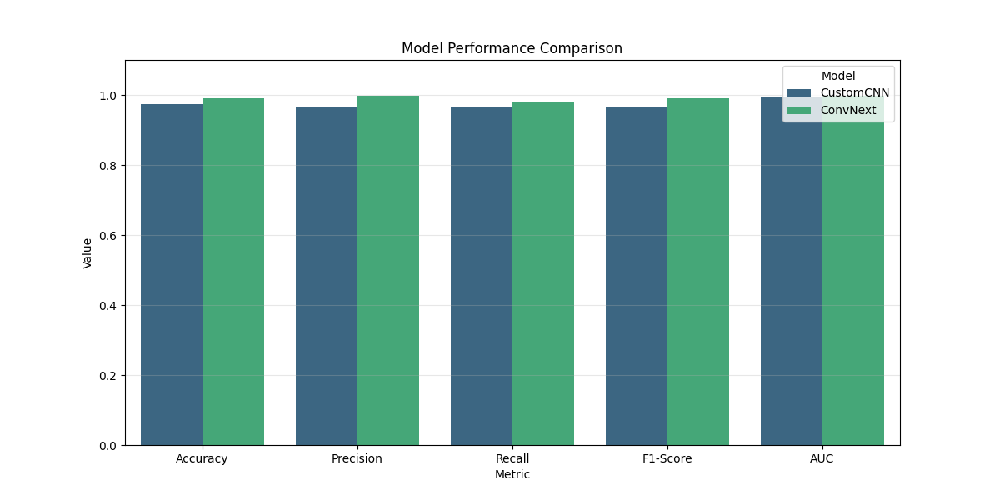
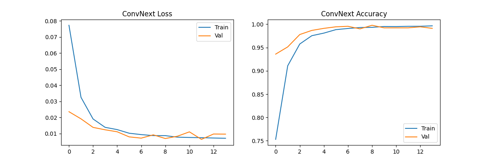
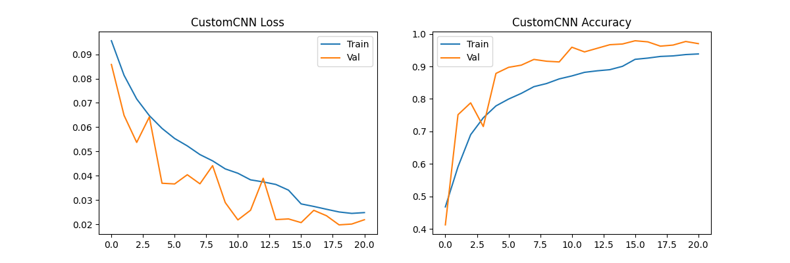
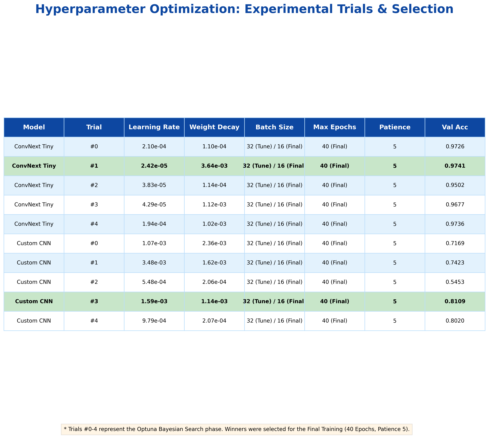
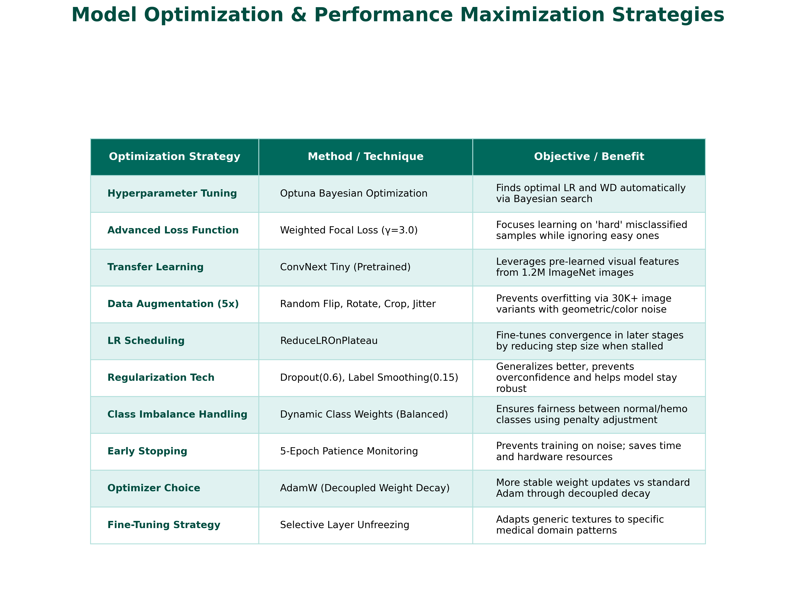

# 🧠 Brain Hemorrhage Classification

Brain Hemorrhage Classification is a high-performance deep learning project designed to detect and classify intracranial hemorrhage in head CT scans. The project compares a **Custom CNN** architecture specifically designed for this task against a state-of-the-art **ConvNeXt Tiny** model using transfer learning.


## 🚀 Key Features

*   **Dual-Model Architecture:** Simultaneous inference and performance comparison between Custom CNN and ConvNeXt models.
*   **Advanced Data Augmentation:** Parallel processing of medical images with recursive folder search and 5x augmentation.
*   **Premium Desktop UI:** A modern, dark-themed GUI built with CustomTkinter for real-time analysis.
*   **Automated Analytics:** Generates ROC curves, Confusion Matrices, and training history plots automatically.
*   **Hyperparameter Optimization:** Utilizes **Optuna** to find the best learning rates and weight decays for the specific dataset.

---

## 🛠️ Step-by-Step Execution Guide

Follow these steps in order to set up and run the project from scratch:

### 1. Environment Setup
Activate your virtual environment and install the required libraries:
```bash
# Activate .venv (Windows)
.venv\Scripts\activate

# Install dependencies
pip install -r requirements.txt
```

### 2. Data Preparation
Prepare the dataset by augmenting the images:
```bash
# Perform 5x data augmentation (detects all subfolders automatically)
python augment_data.py
```

### 3. Training & Optimization
Train the models. This script will first find the best hyperparameters using Optuna and then perform final training on the full dataset (~30,000 images):
```bash
python train.py
```
*Outputs (weights, graphics, metrics) will be saved in the `output/` folder.*

### 4. Generating Reports & Tables
Generate professional-grade tables summarizing the hyperparameter results and optimization techniques:
```bash
# Generate hyperparameter trials table
python scratch/generate_trials_table.py

# Generate model optimization strategies table
python scratch/generate_optimization_table.py

# Collect external samples for presentation (Web-Crawling)
python scratch/web_crawler.py
```
*Tables and external samples will be saved in `output/` and `data/presentation_samples/` respectively.*

### 5. Launching the App
Run the diagnostic dashboard to analyze CT scans:
```bash
python app/desktop_app.py
```

---

## 🤖 Model Architectures

### 1. ConvNeXt Tiny (Transfer Learning)
*   **Base:** Pre-trained on ImageNet-1K.
*   **Modifications:** Custom MLP head (Linear -> BatchNorm -> ReLU -> Dropout(0.6) -> Linear).
*   **Fine-tuning:** Top layers are unlocked for medical domain adaptation.
*   **Strength:** Excellent feature extraction from complex textures.

### 2. Custom CNN (Original)
*   **Structure:** 4 Convolutional blocks (Conv2d -> BatchNorm2d -> LeakyReLU -> MaxPool2d).
*   **Output:** Adaptive Global Average Pooling with a Dense head.
*   **Optimized for:** Speed and focused detection of high-contrast anomalies in CT slices.

---

## 📊 Dataset & Splitting Strategy

The system uses a recursive search to find images in all subfolders (e.g., Patient H1, H2...).

*   **Total Originals:** ~7,000 images.
*   **Training Set:** ~72% of data + 5x Augmentation (~30,000+ total images).
*   **Validation Set:** ~13% used during training to prevent overfitting.
*   **Independent Test Set:** ~15% held out and never seen during training for final diagnostic verification.

---

## 🖼️ Visual Documentation

### 🖥️ Application Dashboard
Below are screenshots from the real-time diagnostic interface, showing different analysis states including consensus and model conflicts.

| Consensus: Hemorrhage | Consensus: Normal | Model Conflict |
| :---: | :---: | :---: |
|  |  |  |

### 📊 Model Analytics & Performance
Comprehensive metrics and visual analysis of the model performance, training history, and optimization results.

#### 1. Confusion Matrices
| ConvNeXt Tiny | Custom CNN |
| :---: | :---: |
|  |  |

#### 2. ROC Curves & Model Comparison
| ROC Curves Comparison | Overall Model Comparison |
| :---: | :---: |
|  |  |

#### 3. Training History
| ConvNeXt Training | Custom CNN Training |
| :---: | :---: |
|  |  |

#### 4. Optimization & Hyperparameters
| Hyperparameter Trials | Optimization Strategies |
| :---: | :---: |
|  |  |

---

## 📁 Project Structure


*   `app/`: Contains the desktop GUI application.
*   `data/`: Raw and augmented medical images.
*   `output/`: Trained models (`.pth`), confusion matrices, and performance metrics.
*   `models.py`: Architecture definitions for both CNN models.
*   `train.py`: Main pipeline for tuning and training.
*   `dataset.py`: Recursive data loading and preprocessing logic.
*   `scratch/`: Scripts for generating visualizations and report tables.

---

## 📝 License
This project is developed for medical research and educational purposes.

---

## ⚡ GPU Acceleration (Recommended)
If you have an NVIDIA GPU, it is highly recommended to install the CUDA-enabled version of PyTorch to speed up training by 10x-50x.

Run the following command to force-reinstall PyTorch with CUDA 12.1 support:
```bash
pip install --force-reinstall torch torchvision torchaudio --index-url https://download.pytorch.org/whl/cu121
```

---

### 🇹🇷 Özet (Turkish Summary)
Bu proje, kafa BT taramalarında beyin kanamasını tespit etmek için geliştirilmiş bir derin öğrenme sistemidir. 
1. **Sanal Ortamı Aktif Et:** `.venv\Scripts\activate`
2. **Kütüphaneleri Kur:** `pip install -r requirements.txt`
3. **Veriyi Hazırla:** `augment_data.py`
4. **Eğitimi Başlat:** `python train.py`
5. **Raporları/Tabloları Oluştur:** `python scratch/generate_trials_table.py` ve `python scratch/generate_optimization_table.py`
6. **Sunum Örneklerini Topla (Web-Crawling):** `python scratch/web_crawler.py`
7. **Uygulamayı Aç:** `python app/desktop_app.py`

> [!TIP]
> **GPU Hızlandırma:** Eğer NVIDIA ekran kartınız varsa, eğitimi çok daha hızlı tamamlamak için yukarıdaki CUDA kurulum komutunu kullanabilirsiniz.
